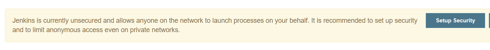
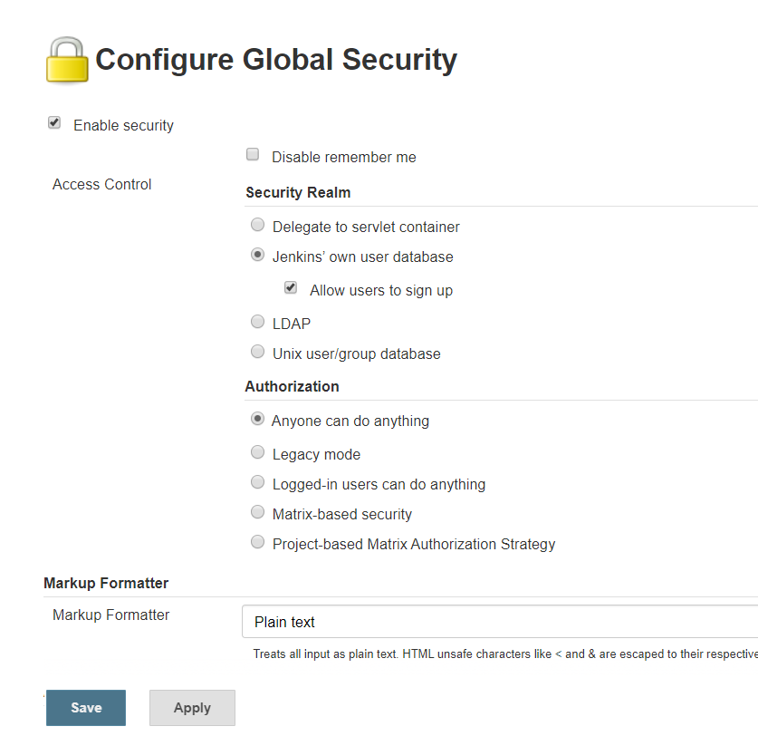
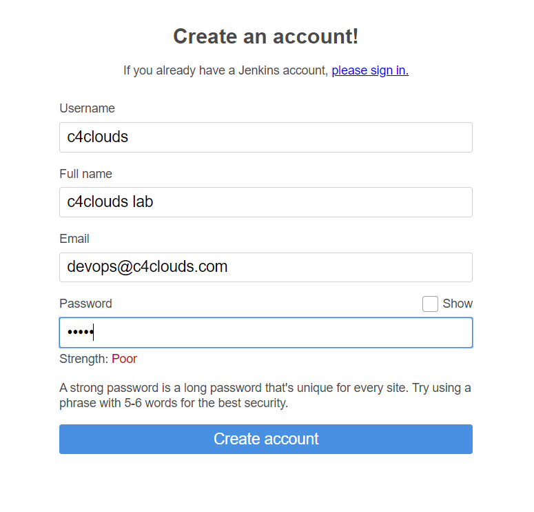
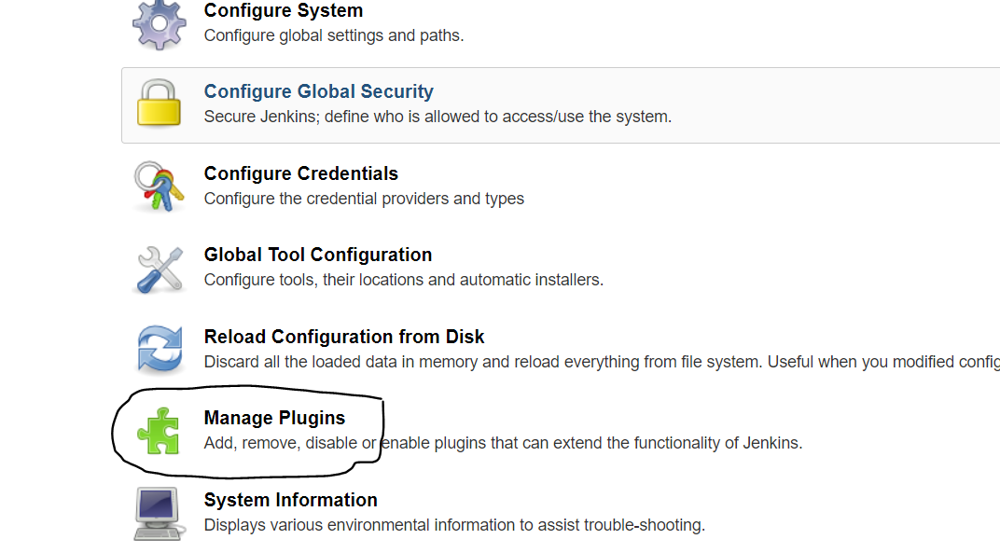

# In this tutorials we are going to learn
1. **Secure Jenkins**
2. **Create a new user**
3. **Generate ssh key for Jenkins user**
4. **Plug-in management**


## Secure Jenkins
Once Jenkins is up and running, Open the Jenkins Home page and click on **Manage Jenkins**


In the Manage Jenkins page, click on **Setup Security** button



In the next page, select the enable security check box, Security Realm -> Jenkin's own user database, apply and save



## Create a new User

Now a link Sign up will be available. Click on the same and fill the form to sign up. Once successful, log in with the account created.

>Note: You can get SignUp link on Jenkins-Node-IP:8080/signup



## Generate ssh key for Jenkins user
```code
sudo sed -i '/jenkins/s/false/bash/g' /etc/passwd
#Or
sudo usermod -s /bin/bash jenkins
sudo -u jenkins ssh-keygen
#That will generate the key for you here: /var/lib/jenkins/.ssh/id_rsa.pub
```

## Plug-in management
Jenkins be easily extended via adding additional plugins in order to accommodate more functionalities. This can be easily done by selecting the option Manage Jenkins - Manage Plugins as shown below



Now search the pulgin and click on Install.

Plugins: 
parameterized-trigger
conditional-buildstep