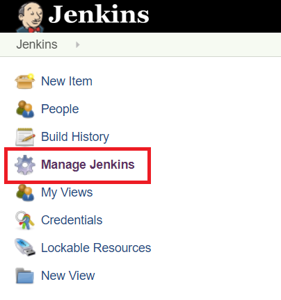

# In this tutorials we are going to learn
1. **Secure Jenkins**
2. **Create a new user**
3. **Generate ssh key for Jenkins user**
4. **Plug-in management**

## Secure Jenkins
Once Jenkins is up and running, Open the Jenkins Home page and click on **Manage Jenkins**

In the Manage Jenkins page, click on **Setup Security** button

In the next page, select the enable security check box, Security Realm -> Jenkin's own user database, apply and save

