# In this tutorials we are going to learn
  1. **Setting Up Jenkins Maven and Freestyle job**
  2. **Jenkins parametrized jobs setup (choice params,boolean params)**
  3. **Email notification jobs**
  4. **Parallel jobs configuration**
  5. **Master slave configuration**


  ## Setting Up Jenkins Maven and Freestyle job

  #### Freestyle job
  For Freestyle job Login to jenkins then click on New Item then provide a name to youre job then select FreeStyle then click on OK.

  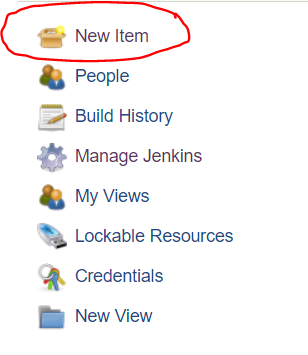

  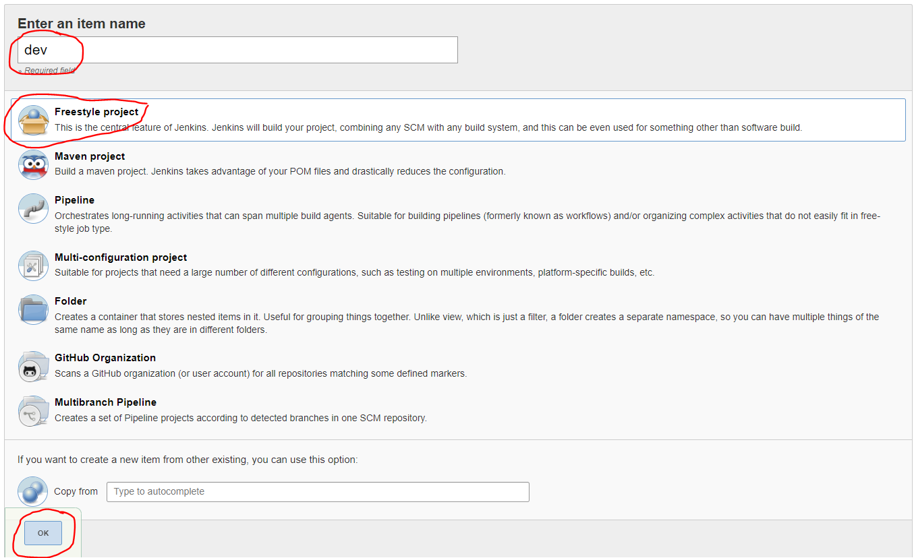

  Now got to the Build and click on **Add Build Step** then select **Execute Shell**. In the Command box provide the command to execute, then click on **save** button then click on BuildNow to trigger a build.

  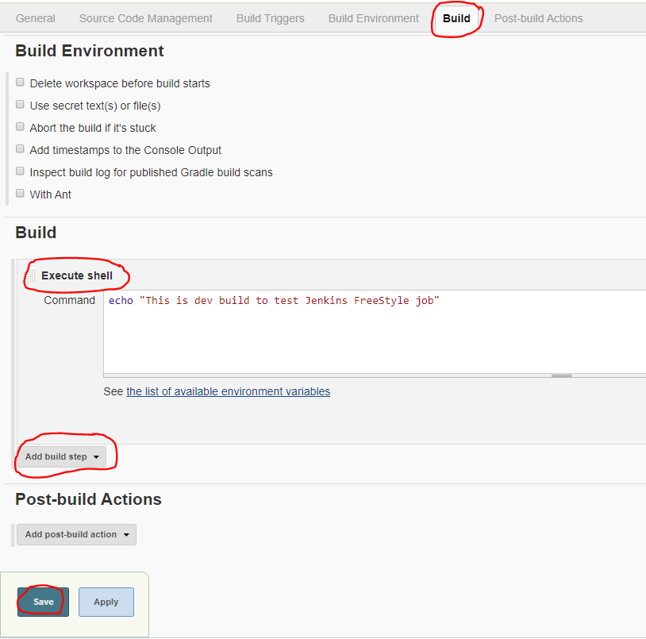

  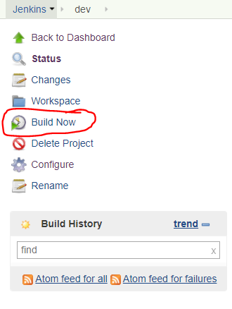

  To view the Console output

  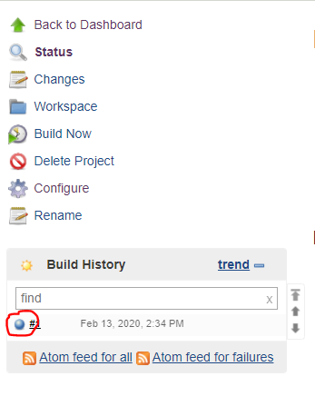

  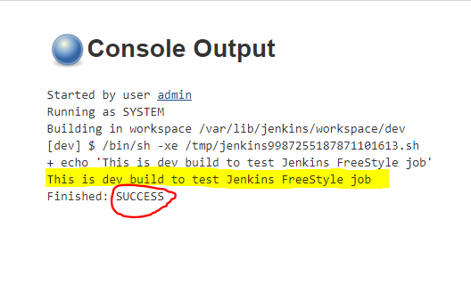 
  
  #### Maven job
  Login to Jenkins then click on **Manage Jenkins** then click on **Global Tool Configuration**. Go to Maven and click on the checkbox to Install automatically then save the changes.
  
  To Install Git 
  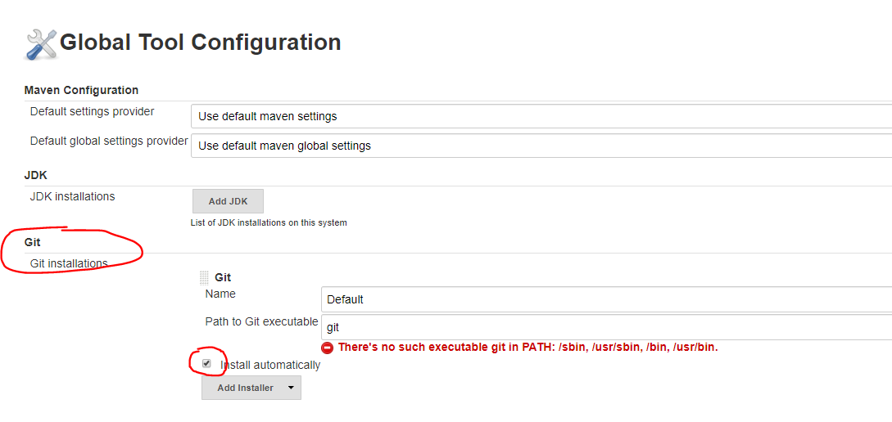
  
  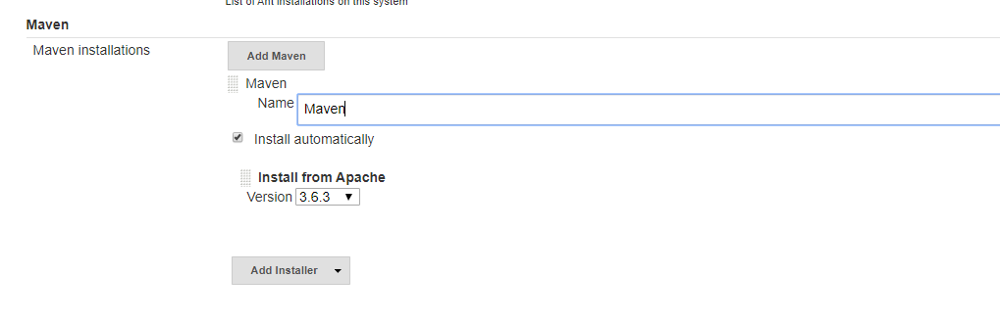

  To Create a Maven job Click on New Item on you Jenkins dashboard then provide name to you job then select Maven Project

  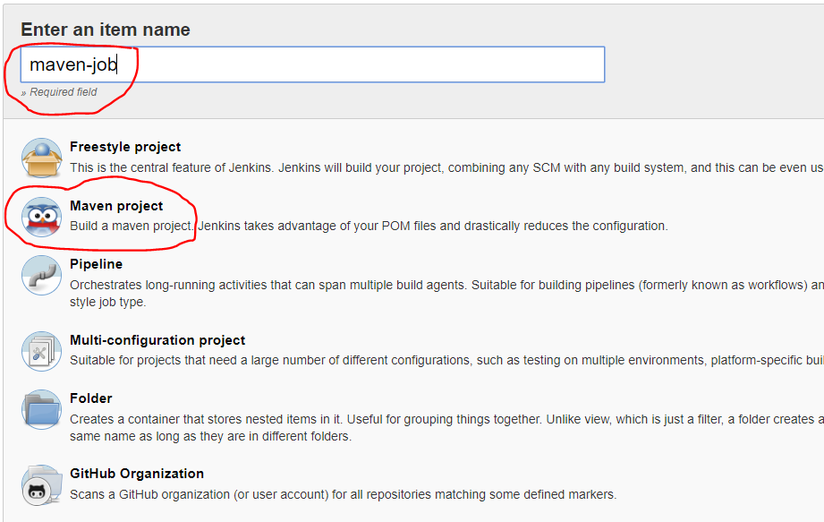

  GitHub Project URL https://github.com/submah/deploy-hello-world-with-jenkins.git
 
  Go to Source Code Management and select Git then provide the repository url as above else you can specify you own github url.
  
  
  
  On Build specify the Goals and Options as **clean package**

  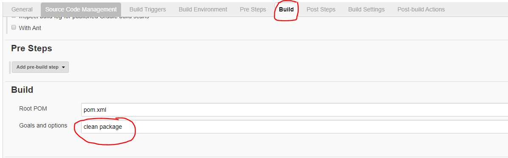
 
  Save the changes and clik on Build now, to see the Console Output click on hte build Number

  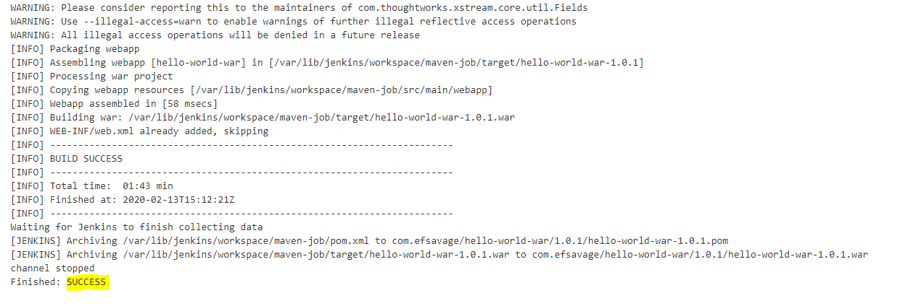

  ## Jenkins parametrized jobs setup
  #### Choice Parameter
 Go to Any Job and click on **This project is parameterized** checkbox. Then click on Add parameter and select **Choice Parameter**
 
 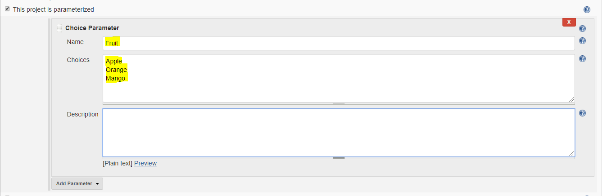
 Go to Build and select **Execute Shell** and Provide the below command 
 ```shell
 echo "You have selected ${Fruit}"
 ```
 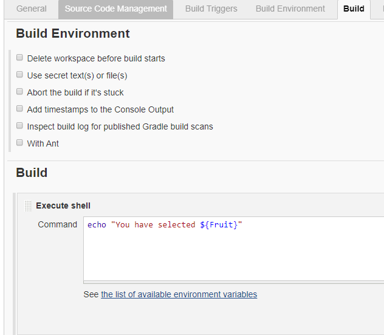

 Now click on **Build with Parameters** Select your choice and click on Build

 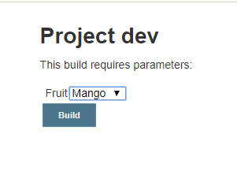

 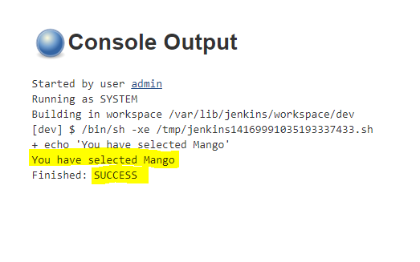

### Boolean Parameter
Go to any project click on **This project is parameterized** then select **String Parameter** under Name field specify FIRST_NAME, add one more **string parameter** under name field specify LAST_NAME then select **boolean Parameter** and under Name field specify SHOW.

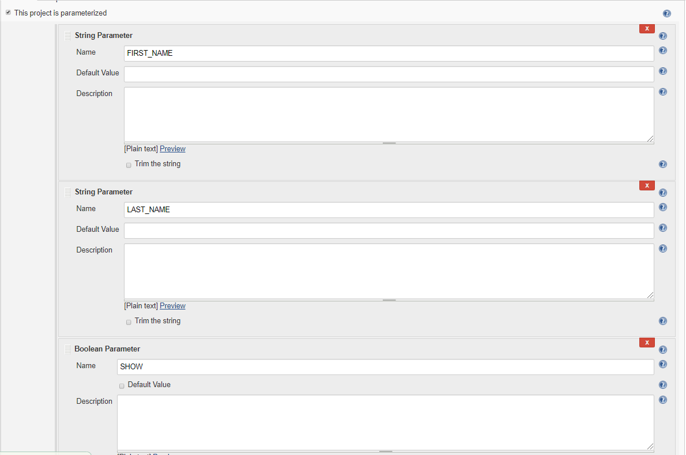

Now go to Build section and select **Execute Shell** and provide the below code
```shell
#!/bin/bash
 

if [ "$SHOW" = "true" ]; then
echo "Hello, $FIRST_NAME $LAST_NAME"
else
echo "You have not selected the show box"
fi
```
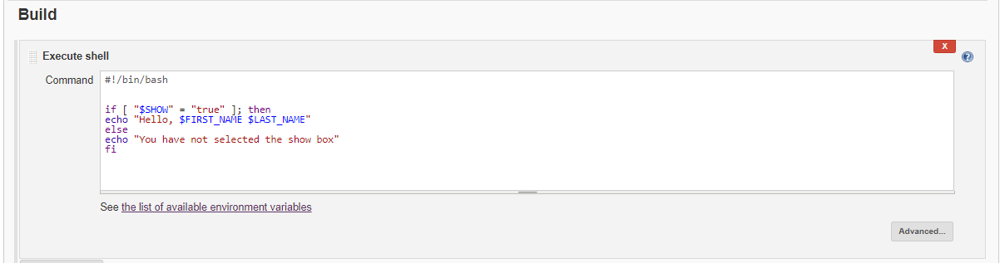

## Email notification jobs
Login to Jenkins, go to **Manage Jenkins** then click on **Configure System** under **Email Notification** provide SMTP server
you can get list of SMTP Server details [here](https://www.arclab.com/en/kb/email/list-of-smtp-and-pop3-servers-mailserver-list.html)

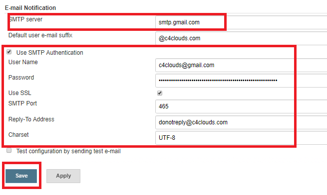

Now go to the Jenkins job where you want to setup email notification and then click on Configure.

Under Post-build Actions click on E-mail Notification.

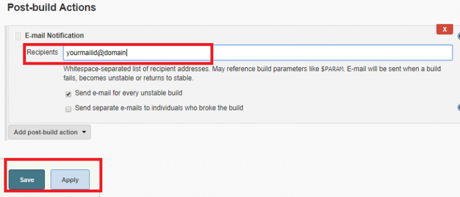


## Parallel jobs configuration
By default, only a single build of a project is executed at a time — any other requests to start building that project will remain in the build queue until the first build is complete.

To enable parallel job configuration for a job, loing to **Jenkins dashboard** then click on **Configure**  and enable the checkbox **Execute concurrent builds if necessary**

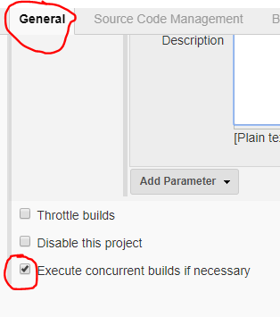

## Master Slave configuration
Jenkins is an awesome Continuous Integration tool which allows you to add multiple slaves as per your project requirement to a central Master server.

It will also monitor the slave state (offline or online) and getting back the build result responses from slaves and the display build results on the console output. The workload of building jobs is delegated to multiple slaves.

> Note: java must be install on the slave node
```code
sudo yum install java-11-openjdk-devel
```

Login you Jenkins and click on **Manage Jenkins** in the left corner on the Jenkins dashboard.

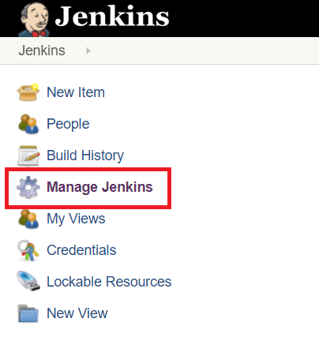

Then click on the option Manage Nodes.

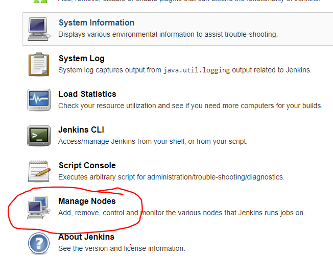

Select New Node and enter the name of the node in the Node Name field.

Select Permanent Agent and click the OK button. Initially, you will get only one option, "Permanent Agent." Once you have one or more slaves you will get the "Copy Existing Node" option.

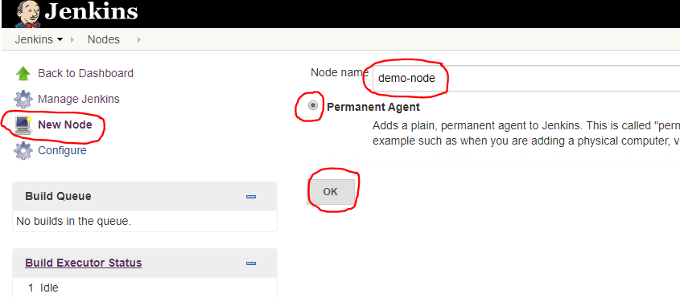

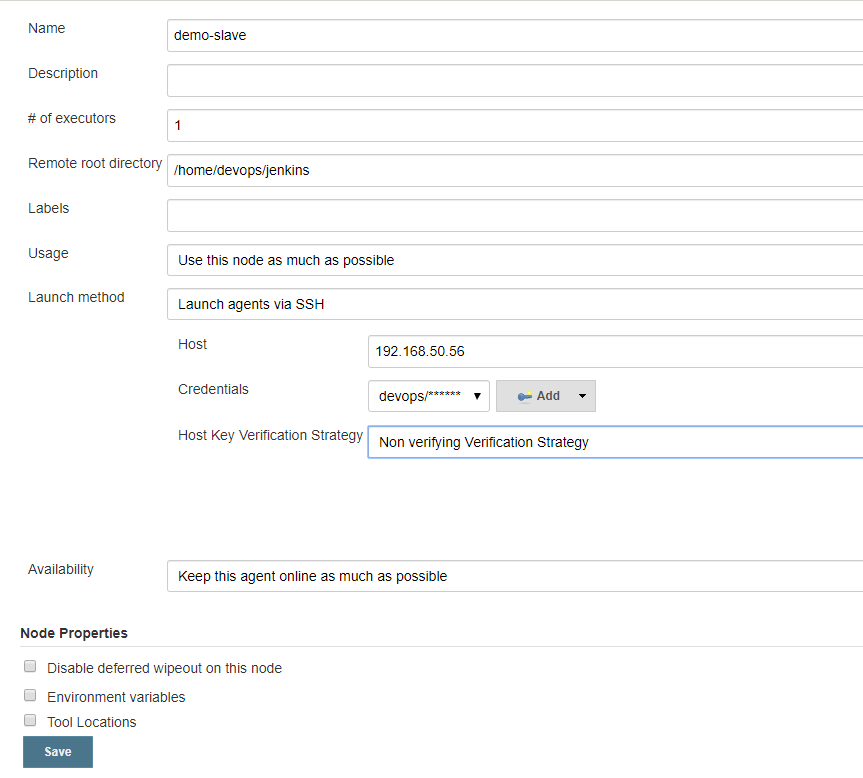


