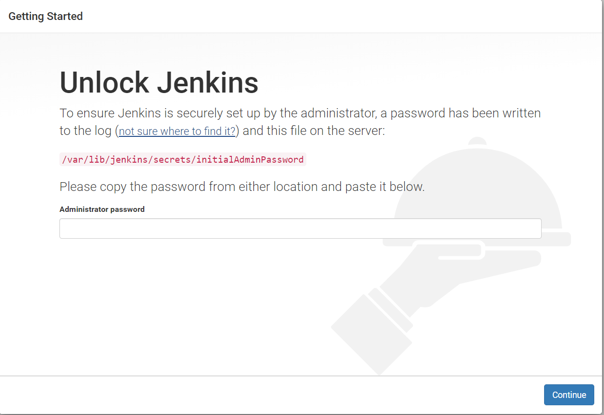

# In this tutorials we are going to learn
 1. **Downloading and Installing Jenkins using TomCat**
 2. **Creating Jenkins as a Service**
 3. **Starting and Stopping Jenkins**


## Install the Java Development Kit
```code
sudo yum install java-1.8.0-openjdk-devel
``` 

## Create Tomcat system user

```
sudo useradd -m -U -d /opt/tomcat -s /bin/false tomcat
```

## Download Tomcat 
We will download the latest version of Tomcat 9.x.x from the [Tomcat downloads page](https://tomcat.apache.org/download-90.cgi) .

wget http://apachemirror.wuchna.com/tomcat/tomcat-9/v9.0.31/bin/apache-tomcat-9.0.31.tar.gz

## Installing Tomcat 
```code
sudo yum update -y
sudo tar -xvf apache-tomcat-9.0.31.tar.gz -C /tmp

sudo mv apache-tomcat-9.0.31 /opt/tomcat/

sudo ln -s /opt/tomcat/apache-tomcat-9.0.31 /opt/tomcat/latest #To create a symbolic link

sudo chown -R tomcat: /opt/tomcat #change the directory ownership 

sudo sh -c 'chmod +x  /opt/tomcat/latest/bin/*.sh' #Make the bin Directory executable

```

## Create a systemd unit file
vi /etc/systemd/system/tomcat.service

**Paste the following content:**

```shell
[Unit]
Description=Tomcat 9 servlet container
After=network.target

[Service]
Type=forking

User=tomcat
Group=tomcat

Environment="JAVA_HOME=/usr/lib/jvm/jre"
Environment="JAVA_OPTS=-Djava.security.egd=file:///dev/urandom"

Environment="CATALINA_BASE=/opt/tomcat/latest"
Environment="CATALINA_HOME=/opt/tomcat/latest"
Environment="CATALINA_PID=/opt/tomcat/latest/temp/tomcat.pid"
Environment="CATALINA_OPTS=-Xms512M -Xmx1024M -server -XX:+UseParallelGC"

ExecStart=/opt/tomcat/latest/bin/startup.sh
ExecStop=/opt/tomcat/latest/bin/shutdown.sh

[Install]
WantedBy=multi-user.target

```
## Notify systemd that we created a new unit file by typing

```
sudo systemctl daemon-reload

```

## Enable and Start the tomcat service

```
sudo systemctl enable tomcat
sudo systemctl start tomcat

```

> Note: Now you can access the tomcat Web-UI with Node-IP:8080

## Downloading jenkins WAR package

```code
sudo wget https://updates.jenkins-ci.org/download/war/2.220/jenkins.war
```

## Installing the WAR
```code
sudo cp jenkins.war tomcat/webapps/
```
```diff
- To get Jenkins Initial password for login 
+ cat /root/.jenkins/secrets/initialAdminPassword
```
> Note: Now you can access the Jenkins Web-UI with **Node-IP:8080/jenkins**

## You can install jenkins directly through yum package
```code
#Enable Jenkins repository by importing hte GPG key
wget -O /etc/yum.repos.d/jenkins.repo https://pkg.jenkins.io/redhat-stable/jenkins.repo

#Add the repository to your system with
sudo rpm --import https://pkg.jenkins.io/redhat-stable/jenkins.io.key

#Once the repository is enabled, install the latest stable version of Jenkins by
sudo yum install jenkins -y

#start the Jenkins service with
sudo systemctl start jenkins

#To check whether it started successfully
sudo systemctl status jenkins

#Finally enable the Jenkins service to start on system boot
sudo systemctl enable jenkins
```

## Setting Up Jenkins
To set up your new Jenkins installation, open your browser and type your domain or IP address followed by port 8080:

```code
http://your_ip_or_domain:8080
```
A screen similar to the following will appear, prompting you to enter the Administrator password that is created during the installation:



## Creating Jenkins as a Service
When you Install the Jenkins through Yum package a jenkins service already created by default.

## Run Jenkins without tomcat

Download the Jenkins war file [link](http://mirrors.jenkins.io/war-stable)

cp jenkins.war /usr/local/bin/jenkins.war

vi /etc/systemd/system/jenkins.service

```
[Unit]
Description=Jenkins Service
After=network.target

[Service]
Type=simple
User=root
ExecStart=/usr/bin/java -jar /usr/local/bin/jenkins.war
Restart=on-abort

[Install]
WantedBy=multi-user.target
```

## Enable, Start and Stop Jenkins
systemctl daemon-reload 

systemctl start jenkins.service

systemctl enable jenkins.service


 
  


